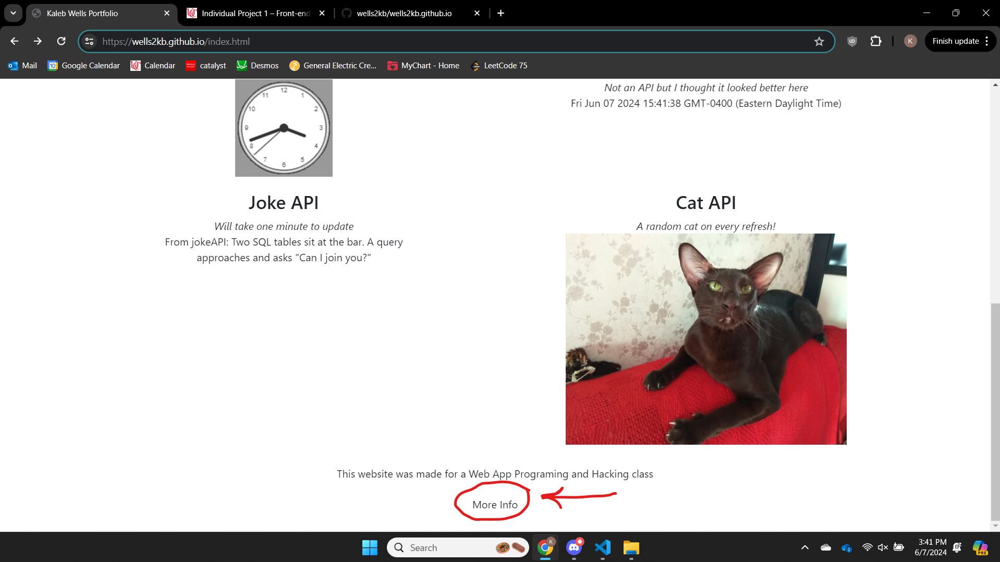
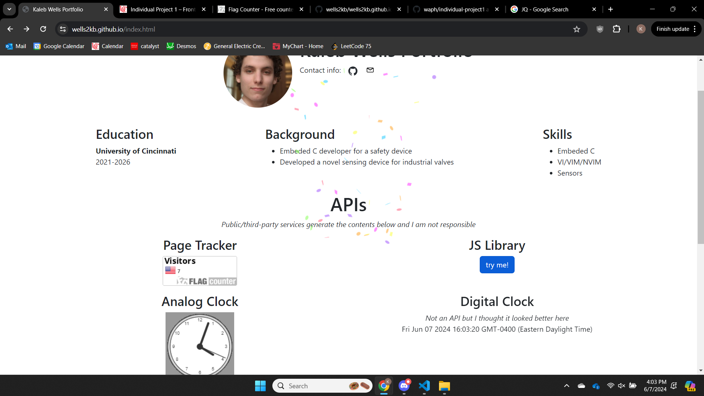

# Individual Project 1 - WAPH-Web Application Programming and Hacking

## Instructor: Dr. Phu Phung

## Student
**Name**: Kaleb Wells

**Email**: wells2kb@mail.uc.edu


## Overview

In this assignment I developed my own webpage

I learned a lot about how to use bootstrap to create pretty and dynamic webpages

I also leared about how to use external APIs/libraries while respecting the single orgin policy

Along the way I ran into some CORS and CORB errors that helped me write better code

Webpage URL: [https://wells2kb.github.io/index.html](https://wells2kb.github.io/index.html)

GitHub URL: [https://github.com/wells2kb/wells2kb.github.io](https://github.com/wells2kb/wells2kb.github.io)

## Task I - General Reqirements

### GitHub Cloud

Deploying the website just meant creating a repo with the right name and adding my webpage to that repo

### WAPH Introduction Page

I created a very simple webpage that briefly explains the class and the assignments for it

To navigate to it just click `More Info` at the bottom of my protfolio



## Task II - Non-technical Reqirements

### Bootstrap

Bootstrap really speed up how fast I could develop my webpage

It's grid layout system helped me cleanly structure my page

It seemed a lot easier to change the class of a div then to play around with 500 CSS settings

My page wasn't rendering well on mobile so I used a breakpoint in one of my rows and it instanly fixed my problems

### Page Tracker

I used Flag Counter as my page tracker

All this took from me was to make a profile and the site gave me a link to an image that was my tracker

I put the link to the tracker image in a `` tag, and that worked as my own tracker

## Task III - Technical Reqirements

### JQuery and JS

The one other JS library I used was canvas-confetti

I used it to add the extra functionality of a button that would cause confetti to shoot across the screen



### Two Web APIs

#### Joke API

All I did here was copy over the code from lab2 into where I wanted it in the DOM

But I did change the type of joke and made the callback function a lambda

#### Second API

I found an API that gives you a random picure of a cat each time you call it

The code to use this API is exactally the same as my page tracker

### Cookies

I used the document.cookie to read and write to my cookie

I didn't find a JQuery way to do this that didn't require a lib

I used a regex pattern to match to the time data that I would store inside of square brackets

If `prevTime` was null then I assumend that it was the frist time that the page was beign viewed

Every time the page was opened it would update the cookie

```
  <div id="welcomeAlert" class="alert alert-primary text-center" role="alert">
    <script>
      var prevTime = document.cookie.match(/(?<=prevTime=\[).+(?=\])/);

      var welcomeText = prevTime
        ? "Welcome back! Your last visit was " + prevTime
        : "Welcome to my homepage for the first time!";

      document.cookie = "prevTime=[" + Date() + "]";

      $("#welcomeAlert").text(welcomeText);
    </script>
  </div>
```